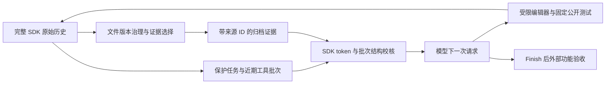

# 可复现演示病例：Click 命令别名

这是 v18 开发试跑中的一个成功病例，特意用于演示系统流程，不代表整组平均收益。所有成功、失败和负收益见 FOLLOWUP_REPAIR_REVIEW.md。

## 展示顺序

1. 显示 TASK.md：别名解析、装饰器转发、补全、原子冲突检查等功能约束。
2. 显示 SDK 原始 Action/Observation：工具读取和修改的原始历史仍保留。
3. 显示 pruner-state.json：归档源 ID、文件版本、证据范围及窗口保留记录，省略代码有恢复路径。
4. 显示最终工作区与外部测试：15 项功能验收加 110 项选定上游回归，共 125 项通过，Agent 正常 finished。
5. 显示完整三组报告，说明这只是一个病例，不能以此替代全配对均值。

## 该病例指标

- 无压缩实际输入：831,529；插件实际输入：599,303，减少 27.93%。
- 请求次数：无压缩 26、插件 30；不能声称插件减少了调用次数或证明更快。
- 接受压缩 3 次，SDK 估算压缩后范围 16,592～18,905，硬界 32,000。
- 两组代码验收通过并正常结束；金额未知，不把 SDK 0 美元当作免费。

## 证据位置

- runs/stage5-openhands/independent-two-projects-1x3-v18/audit.json
- 同目录 r1-click_aliases-none / r1-click_aliases-pruner_v9 的 report.json、ledger、conversation 原事件。
- 插件最终代码：同目录 workspaces/w002；外部验收结果在对应 evaluation-final 及 evaluation-audit。
- 冻结协议：INDEPENDENT_PROTOCOL_V18.md；实现：prototype_v9.py。

公开答辩截图隐藏 API 密钥和个人目录。演示优先播放已保存的轨迹；复跑必须用新输出目录并注明产生新模型费用。

## 模型视图流程

该图描述 OpenHands 实验适配器的实际流程。归档指向已保存原事件，未实现自动跨进程恢复工具，不将它画成已验证的完整恢复闭环。
